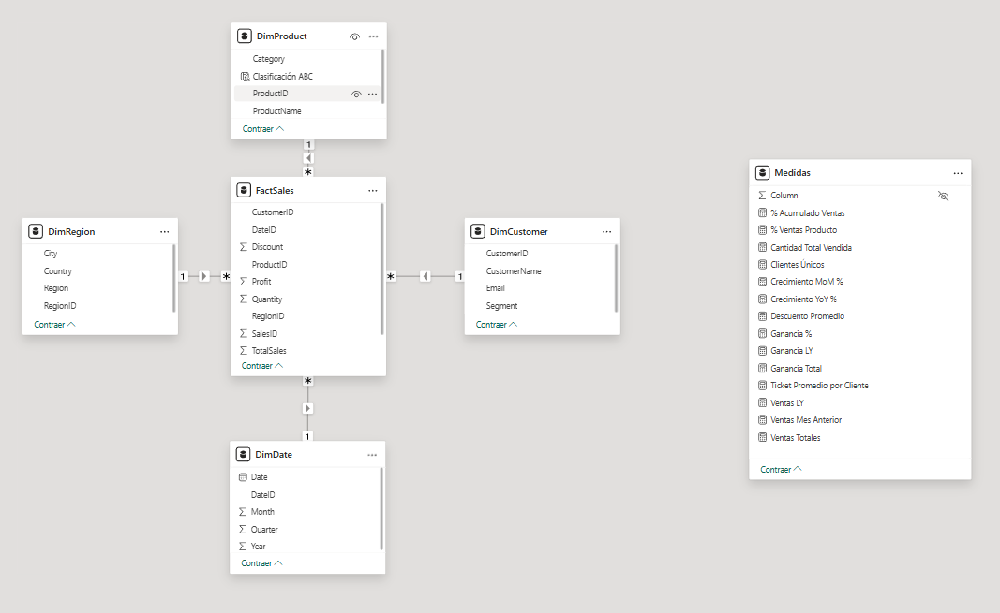
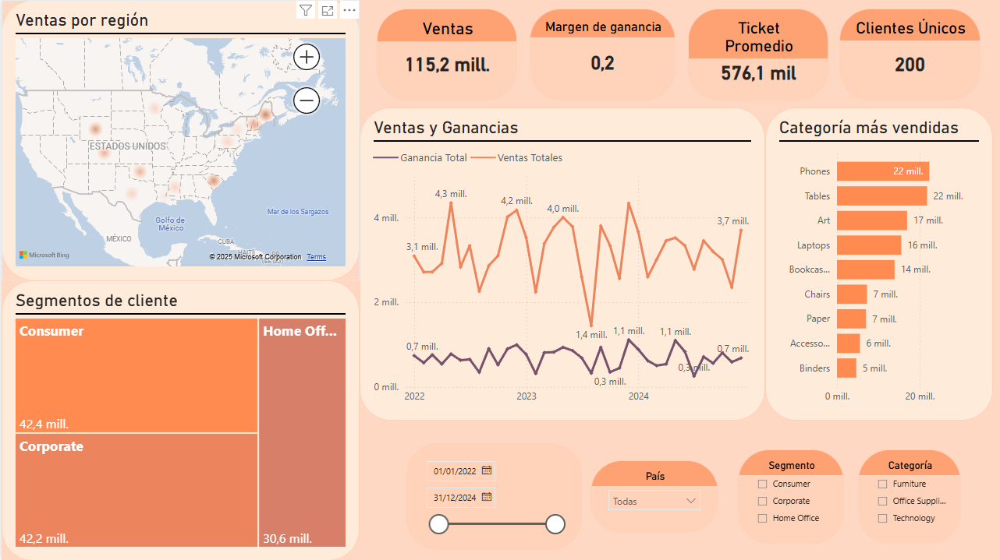
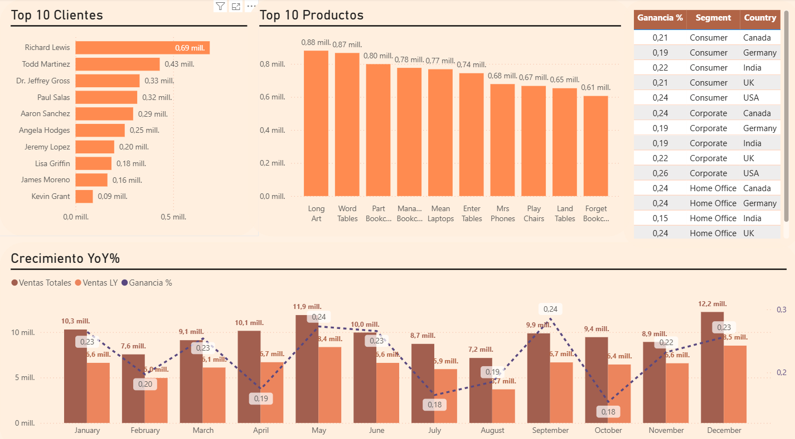

# 📊 Dashboard de Ventas con Power BI

Este proyecto consiste en el desarrollo de un cuadro de mando interactivo con Power BI para el análisis de ventas por producto, cliente, región y segmento.

La solución está basada en un modelo estrella con medidas DAX personalizadas, visualizaciones interactivas y segmentación por múltiples filtros.

---

## 🧱 Modelo de datos

El modelo sigue una estructura de esquema estrella con una tabla de hechos (`FactSales`) y varias dimensiones (`Product`, `Customer`, `Region`, `Date`):

---

## 🧠 Medidas personalizadas (DAX)

Entre las medidas calculadas se encuentran:

- `Ventas Totales`
- `Ganancia Total`
- `Ganancia %`
- `Crecimiento MoM %`
- `Crecimiento YoY %`
- `Ventas LY`
- `Ventas Mes Anterior`
- `Clientes Únicos`
- `Ticket Promedio`
- `% Acumulado Ventas`
- `% Ventas Producto`

Estas medidas permiten analizar la evolución de las ventas, el rendimiento de los productos, la fidelización de clientes y detectar patrones de crecimiento.

---

## 📈 Visualizaciones del dashboard

### Página 1: Visión general

### Página 2: Análisis detallado

---

## 🎯 Objetivos del dashboard

- Visualizar de forma clara la evolución de ventas y ganancias
- Identificar productos, segmentos y regiones clave
- Analizar el crecimiento YoY y mensual
- Evaluar el comportamiento de clientes y su ticket promedio

---

## 🧩 Tecnologías utilizadas

- **Power BI Desktop**
- **DAX (medidas personalizadas)**
- Modelo estrella optimizado para análisis de ventas
- Visualizaciones: mapas, gráficos de líneas, barras, treemap, matrices y slicers

---

📧 sandraconcagomez@gmail.com  
🔗 [LinkedIn](https://www.linkedin.com/in/sandraconcagomez/)
